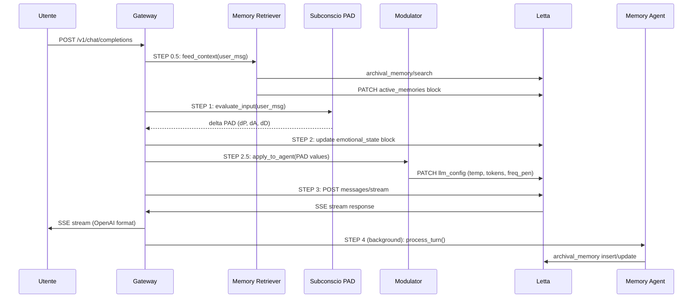

# Architettura del Sistema

## Panoramica

Scarlet è composta da tre layer principali orchestrati da un Gateway API:

```
Client (Open WebUI)
       │
       ▼
   Gateway (:8000)     ←→    Subconscio (PAD Engine)
       │                          │
       ▼                          ▼
   Letta (:8283)           Ollama GPU (:11434)
       │                     qwen2.5:7b
       ▼                     mxbai-embed-large
   MiniMax M2.5
   (Cloud API)
```

## Flusso di un Messaggio



## Componenti

### Scarlet Gateway (`scarlet_gateway/`)
- **Ruolo**: Hub API, proxy OpenAI-compatibile
- **Route**: `/v1/chat/completions` (pipeline completa), `/api/pad/*`, `/api/letta/*`
- **Porta**: 8000

### PAD Engine (`scarlet_pad/`)
- **Ruolo**: Subconscio emotivo (Pleasure-Arousal-Dominance)
- **Moduli**: `core.py` (matematica), `subconscious.py` (evaluator), `modulator.py` (PAD→LLM), `letta_sync.py` (sync blocco)
- **GPU**: DistilBERT multilingue per sentiment analysis

### Memory System (`scarlet_memory/`)
- **Ruolo**: Estrazione, salvataggio e recupero memorie
- **Moduli**: `agent.py` (Background, usa qwen2.5:7b), `retriever.py` (Pre-turno, popola blocchi)
- **Categorie**: user_profile, user_preference, relationship, event, self_reflection

### Letta Server (Docker)
- **Ruolo**: Core agent con memory blocks e archival memory
- **Modello**: MiniMax M2.5 (cloud, 200K context, reasoner attivo)
- **Embedding**: mxbai-embed-large (Ollama locale, 1024 dim)
- **Porta**: 8283

### Ollama (Docker GPU)
- **Ruolo**: Modelli locali (embedding + memory extraction)
- **Modelli**: mxbai-embed-large, qwen2.5:7b
- **Porta**: 11434

## Memory Blocks

Letta mantiene 8 blocchi di memoria sempre in contesto:

| Blocco | Scopo | Gestione |
|---|---|---|
| `identity` | Chi è Scarlet | Statico (system) |
| `relationships` | Dinamica relazionale con l'utente | Scarlet (conscious) |
| `goals` | Obiettivi attuali | Scarlet (conscious) |
| `world_model` | Comprensione del mondo | Scarlet (conscious) |
| `cognitive_patterns` | Pattern cognitivi e di apprendimento | Statico (system) |
| `emotional_state` | Stato PAD corrente | Subconscio automatico |
| `inner_world` | Pensieri, riflessioni, journal | Scarlet (conscious) |
| `active_memories` | Memorie richiamate per il turno | Retriever automatico |

## Networking (Docker)

```
Host Windows
├── Gateway (python, :8000) ──→ localhost:8283 (Letta)
├── Browser (Open WebUI, :3000) ──→ localhost:8000 (Gateway)
│
└── Docker
    ├── scarlet-letta (:8283)
    │   └── ──→ host.docker.internal:11434 (Ollama)
    │   └── ──→ api.minimax.io (MiniMax cloud)
    ├── scarlet-ollama (:11434, GPU passthrough)
    └── scarlet-ui (:3000, Open WebUI)
```
